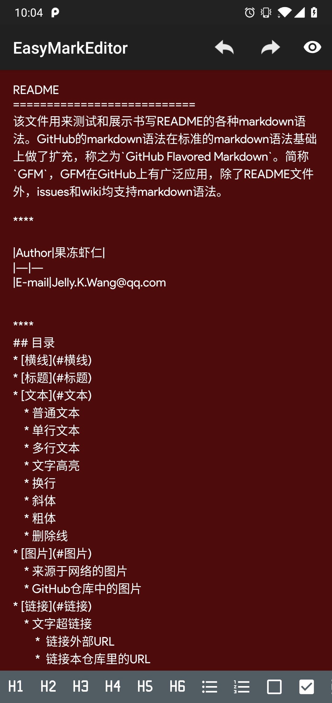
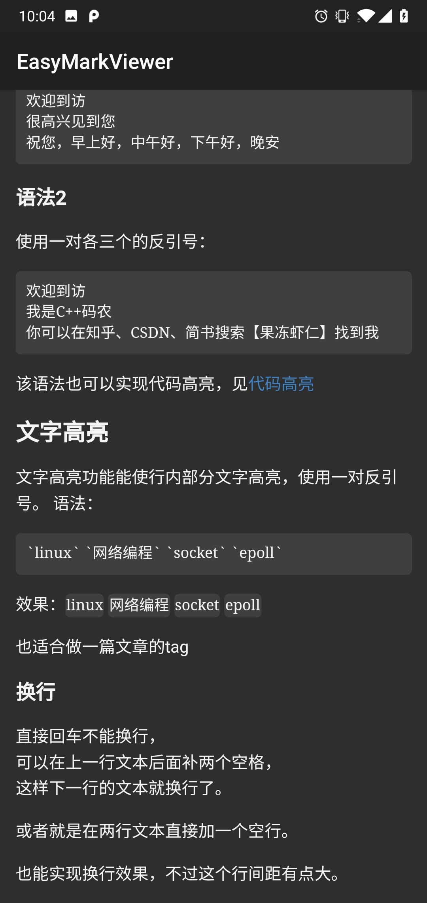
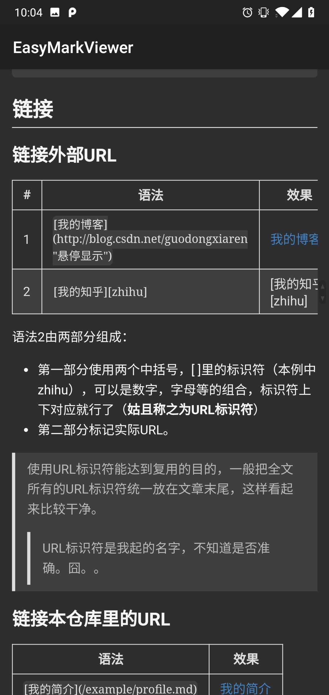
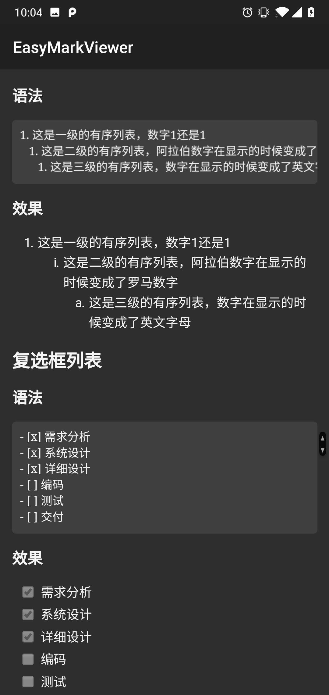
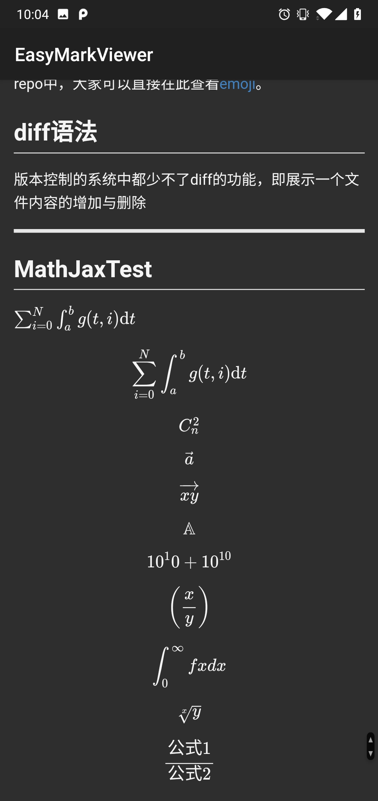

# EasyMark

EasyMark is an open source project, aim at providing a markdown editor and viewer for better performance. This project used to be one part of my another open source app [MarkNote](https://github.com/Shouheng88/MarkNote). If you are interested in building an markdown note-taking application, you can refer to that project at [https://github.com/Shouheng88/MarkNote](https://github.com/Shouheng88/MarkNote).

## Functions

Here are some screenshots of this project,

The functions included now:

For editor:

1. Based on the AppCompactEditText;
2. Not real-time parsing and display, only display your raw markdown text;
3. You can add your own functions by implementing the interface provided;
4. Provided cool fast scroller;
5. Support the BaseSoftInputLayout, to use it, you need to inlcude the sil dependence.

For viewer:

1. Based on the WebView, for it has a better performance and many cool features;
2. Support many basic markdown grammers;
3. Support MathJax;
4. Provided the interface to handle the image and link click event;
5. Provided the interface for custom CSS;
6. Support the raw HTML in markdown;
7. Provided cool fast scroller.

## Usage

First, include my maven center,

    maven { url "https://dl.bintray.com/easymark/Android" }

Then add the dependence in your proejct if you want to use EasyMark editor and viewer,

    implementation 'me.shouheng.easymark:easymark:0.0.2'

Or maven, 
	
	<dependency>
	  <groupId>me.shouheng.easymark</groupId>
	  <artifactId>easymark</artifactId>
	  <version>0.0.2</version>
	  <type>pom</type>
	</dependency>	
	
If you want to use the SoftInputLayout in your project, include the following dependence in your gradle,

	implementation 'me.shouheng.easymark:sil:0.0.1'

Or maven,

	<dependency>
	  <groupId>me.shouheng.easymark</groupId>
	  <artifactId>sil</artifactId>
	  <version>0.0.1</version>
	  <type>pom</type>
	</dependency>
	
For more, please refer to the sample project.

## Change log

- EasyMark VERSION 0.0.1 : First release
- EasyMark VERSION 0.0.2 : Fixed the method name and set the DayOneFormatHandler not final

## Contact

If you have any good idea please contact me at [shouheng2015@gmail.com](mailto:shuoheng2015@gmail.com)
