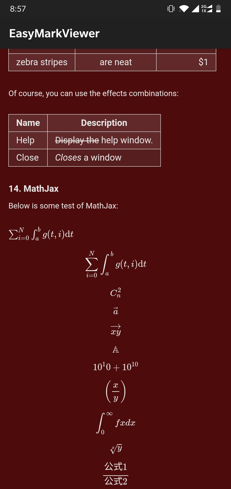

# EasyMark


[](https://www.codacy.com/manual/Shouheng88/EasyMark?utm_source=github.com&amp;utm_medium=referral&amp;utm_content=Shouheng88/EasyMark&amp;utm_campaign=Badge_Grade)
[](https://travis-ci.org/Shouheng88/EasyMark)

EasyMark is an open source project, aim at providing a markdown editor and viewer for better performance. This project used to be part of my another open source App [MarkNote](https://github.com/Shouheng88/MarkNote). If you are interested in building an markdown note-taking application, you can refer to that project at [https://github.com/Shouheng88/MarkNote](https://github.com/Shouheng88/MarkNote). If you want to include markdown features with fewer cost, read this README and learn how to use this library in your project.

## 1. Functions

Here are some screenshots of this project,

<div style="display:flex;" id="target">





</div>

The functions included now:

For editor:

1. Based on the AppCompactEditText;
2. Not real-time parsing and display, only display your raw markdown text;
3. You can add your own functions by implementing the interface provided;
4. Provided cool fast scroller;
5. Support the BaseSoftInputLayout, to use it, you need to inlcude the sil dependence.

For viewer:

1. Based on the WebView, for it has a better performance and many cool features;
2. Support many basic markdown grammers;
3. Support MathJax;
4. Provided the interface to handle the image and link click event;
5. Provided the interface for custom CSS;
6. Support the raw HTML in markdown;
7. Provided cool fast scroller.

## 2. Usage

First, you must include jCenter,

```gradle
allprojects {
    repositories {
        jcenter()
    }
}
```

Then add the dependence in your proejct if you want to use EasyMark editor and viewer,

```gradle
implementation 'me.shouheng.easymark:easymark:$latest-version'
```
Or maven, 

```xml
	<dependency>
	  <groupId>me.shouheng.easymark</groupId>
	  <artifactId>easymark</artifactId>
	  <version>0.0.2</version>
	  <type>pom</type>
	</dependency>	
```

If you want to use the SoftInputLayout in your project, include the following dependence in your gradle,

```gradle
implementation 'me.shouheng.easymark:sil:$latest-version'
```
Or maven,

```xml
	<dependency>
	  <groupId>me.shouheng.easymark</groupId>
	  <artifactId>sil</artifactId>
	  <version>0.0.1</version>
	  <type>pom</type>
	</dependency>
```

For more, please refer to the sample project.

## 3. Change Log

- EasyMark VERISON 0.1.0 : Changed code style and css style for viewers
- EasyMark VERSION 0.0.2 : Fixed the method name and set the DayOneFormatHandler not final
- EasyMark VERSION 0.0.1 : First release

## 4. Contact

I'm WngShhng (Shouheng Wang). You can follow me at:

1. Twitter: https://twitter.com/shouheng_wang
2. Github: https://github.com/Shouheng88
3. Blog: https://juejin.im/user/585555e11b69e6006c907a2a

If you have any good idea please contact me at [shouheng2015@gmail.com](mailto:shuoheng2015@gmail.com)

## License

```
Copyright (c) 2019-2020 WngShhng.

Licensed under the Apache License, Version 2.0 (the "License");
you may not use this file except in compliance with the License.
You may obtain a copy of the License at

   http://www.apache.org/licenses/LICENSE-2.0

Unless required by applicable law or agreed to in writing, software
distributed under the License is distributed on an "AS IS" BASIS,
WITHOUT WARRANTIES OR CONDITIONS OF ANY KIND, either express or implied.
See the License for the specific language governing permissions and
limitations under the License.
```

